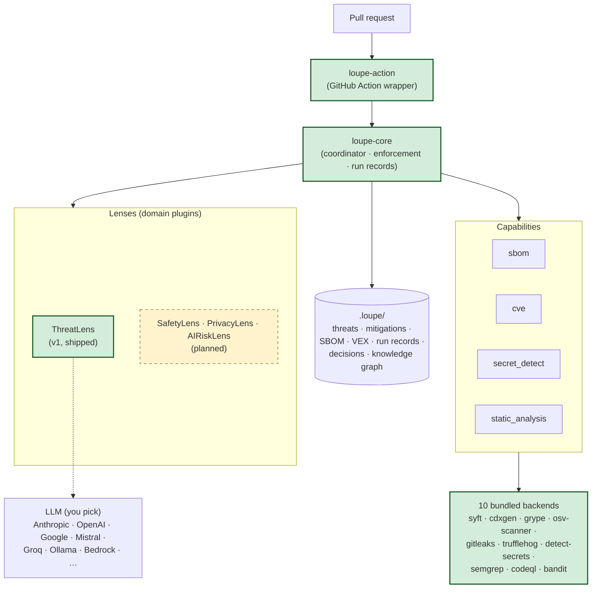

<div align="center">


# Loupe

**Auditor-credible AI lenses for code review.**

*Threat models, hazard analyses, privacy reviews. Same platform, different lens.*

[](LICENSE)
[](https://www.python.org/)
[](#status)
[](https://github.com/fadi-labib/loupe/actions/workflows/tests.yml)
[](https://github.com/fadi-labib/loupe/actions/workflows/docs.yml)
[](https://github.com/fadi-labib/loupe/actions/workflows/prose-check.yml)
[](https://github.com/fadi-labib/loupe/actions/workflows/link-check.yml)

[Docs](docs/index.md) · [Quickstart](docs/quickstart.md) · [Architecture](docs/concepts/architecture.md) · [Verification](docs/reference/verification.md) · [Decisions](docs/reference/decisions.md) · [Changelog](CHANGELOG.md)

</div>

<p align="center">
  <picture>
    <source media="(prefers-reduced-motion: reduce)" srcset="./docs/assets/hero-static.svg" />
    
  </picture>
  <br />
  <sub>Source code is inspected by capability lenses (SBOM, CVE, Secret, SAST, ThreatLens); findings flow into a hash-chained <code>.loupe/</code> artefact pack; <code>loupe verify</code> confirms each block.</sub>
</p>

On every pull request, Loupe runs a Pydantic-typed agent over a composable stack of SBOM, CVE, secret, and SAST scanners. Findings land as Git-tracked YAML in `.loupe/`, the run record is hash-chained, and a sticky PR comment posts the summary.

`loupe verify` replays the whole chain from in-repo state alone. No SaaS, no telemetry, no hidden cache. You pick the LLM, you pick the tools; the configuration is the evidence.

---

<details>
<summary><b>Table of contents</b></summary>

- [The problem](#the-problem)
- [The bet](#the-bet)
- [Compared to what's out there](#compared-to-whats-out-there)
- [The mental model](#the-mental-model)
- [Architecture at a glance](#architecture-at-a-glance)
- [Quickstart](#quickstart) · [GitHub Action](#github-action)
- [What lives in `.loupe/`](#what-lives-in-loupe)
- [Sample output](#sample-output)
- [You pick the LLM. You pick the tools.](#you-pick-the-llm-you-pick-the-tools)
- [Defence in depth (four layers)](#defence-in-depth-four-layers)
- [Status](#status)
- [Why now: the CRA timeline](#why-now-the-cra-timeline)
- [Where to find things](#where-to-find-things)
- [Built on](#built-on)
- [Contributing](#contributing) · [Security](#security) · [Licence](#licence)

</details>

## The problem

Software-engineering risk activities (threat modelling, hazard analysis, privacy review) share a structural failure mode. Artefacts drift out of sync with the code they describe. The work needed to keep them current is the slow, careful, evidence-shaped work most engineers will not do without external pressure.

Two failure modes show up everywhere.

**Stale documents.** A wiki page from 2023 still claims the service uses session cookies, two years after the OAuth migration. An auditor reads it. The auditor is satisfied. The document is wrong.

**Compliance theatre.** A scanner emits a 200-page PDF on every commit. Nobody reads it. The process runs. No actual analysis happens.

The EU Cyber Resilience Act (fully applicable December 2027) makes both worse. Manufacturers must maintain a current risk assessment, a current secure-by-design rationale, a current SBOM, and current per-vulnerability impact statements. Living documents, not point-in-time PDFs filed after release.

## The bet

| Claim | Shape |
|---|---|
| AI agents can do the slow, careful, evidence-shaped work | … provided their outputs are structured, auditable, and human-reviewed at the boundaries that matter |
| A plugin platform with separate domain lenses is the right shape | Threat modelling, safety analysis, privacy review have different methods but share infrastructure (diff parsing, SBOM generation, artefact storage, enforcement, MCP exposure) |
| The platform must be auditor-credible from day one | Standards-conformant outputs (CycloneDX, OpenVEX, STRIDE), Git-versioned artefacts, hash-chained run records, write-boundary enforcement in code (not policy) |
| The bet is falsifiable | Hand a Loupe-produced threat model and a senior-engineer-produced one for the same PR to a third-party auditor blinded to authorship. If they can distinguish them on artefact quality, the bet fails. The benchmark methodology is recorded in [D-19](docs/reference/decisions.md#d-19). |

## Compared to what's out there

|                          | Loupe         | StrideGPT     | IriusRisk     | Threat Dragon |
|--------------------------|:-------------:|:-------------:|:-------------:|:-------------:|
| In-repo artefacts        | ✓ Git-tracked | ✗ web UI      | ✗ SaaS DB     | ~ JSON export |
| Hash-chained audit trail | ✓             | ✗             | ✗             | ✗             |
| Multi-LLM                | ✓ 8 providers | ~ OpenAI-only | n/a           | n/a           |
| Auditor-replayable       | ✓ `loupe verify` | ✗          | ✗             | ✗             |
| OSS, no SaaS             | ✓ Apache 2.0  | ~ partial     | ✗ commercial  | ✓ OWASP       |

<sub>Snapshot dated 2026-05-16. Row-by-row breakdown with version-pinned sources and methodological caveats: [`docs/comparison.md`](docs/comparison.md).</sub>

## The mental model

The shortest correct answer to *"what is Loupe?"* is a medical-clinic metaphor that holds all the way down.

> A pull request rolls in (the **patient**). The **clinic** decides which **specialists** should see this patient. The specialists order the **diagnostic tests** they need. The clinic writes up a **chart** an external auditor can read.

| Role | What it is | What it does | In Loupe |
|---|---|---|---|
| Clinic | Platform | Orchestrates, files paperwork, enforces boundaries | `loupe-core` |
| Specialist | Lens | Brings domain expertise, decides what to look for | `ThreatLens` (security), `SafetyLens` *(future)*, `PrivacyLens` *(future)* |
| Diagnostic test | Capability | A tool category specialists can order | `sbom`, `cve`, `secret_detect`, `static_analysis` |
| Test machine | Backend | The specific tool that performs the test | `syft`, `cdxgen`, `grype`, `trufflehog`, `semgrep`, … |
| Chart | Artefact | The patient's medical record | Files in `.loupe/` |

## Architecture at a glance



Each layer is replaceable without disturbing the others. Swap `syft` for `trivy` and lenses do not notice. Add `AutoCyberLens` for TARA and the platform does not change. Change the GitHub Action wrapper for a GitLab one and the core stays the same.

## Quickstart

> [!WARNING]
> **Pre-alpha · pre-PyPI.** Loupe is wired end-to-end but the API will move before v0.1 tags. Install from source for now; the artefact schemas are the stable surface.

```bash
git clone https://github.com/fadi-labib/loupe.git
cd loupe
uv sync --all-packages
```

Pre-PyPI, the CLI lives in the workspace venv. Invoke it against your project with `uv run --project /path/to/loupe`; post-v0.1 the prefix collapses to bare `loupe`.

```bash
cd ~/projects/your-repo
uv run --project /path/to/loupe loupe init                       # scaffold .loupe/
$EDITOR .loupe/context.md                                        # describe your product (anti-hallucination anchor)
export ANTHROPIC_API_KEY="sk-ant-…"                              # or OPENAI_API_KEY / GOOGLE_API_KEY / etc.
uv run --project /path/to/loupe loupe doctor                     # preflight: keys, binaries, config
uv run --project /path/to/loupe loupe ci --diff-file <(git diff main...)
```

A full walk-through with screenshots is in the [Quickstart](docs/quickstart.md).

### GitHub Action

```yaml
# .github/workflows/loupe.yml
on:
  pull_request:

jobs:
  loupe:
    runs-on: ubuntu-latest
    steps:
      - uses: actions/checkout@v4
      - uses: fadi-labib/loupe/packages/loupe-action@main   # post-v0.1: fadi-labib/loupe-action@v0.1
        with:
          pr: ${{ github.event.pull_request.number }}
          comment_mode: sticky                # or 'new' or 'none'
        env:
          GITHUB_TOKEN: ${{ secrets.GITHUB_TOKEN }}
          ANTHROPIC_API_KEY: ${{ secrets.ANTHROPIC_API_KEY }}
```

| Exit code | Meaning |
|:-:|---|
| `0` | Clean run; no severity in `ci.fail_on` triggered |
| `1` | Gate failure: a threat at a `ci.fail_on` severity was reported |
| `64` | Usage / configuration error (BSD `sysexits.h` `EX_USAGE`) |

The Action publishes eight outputs (`findings_count`, severity-specific counts, `run_id`, `run_hash`, `exit_code`). See [`action.yml`](packages/loupe-action/action.yml) for the full schema.

## What lives in `.loupe/`

> [!NOTE]
> The audit pack is plain files, Git-tracked, no SaaS, no hidden state, no telemetry. An auditor can replay every run from in-repo state alone; the `runs/*.json` hash chain detects history rewrites.

| File | Who writes it | What it is |
|---|---|---|
| `context.md` | Human | Product brief; the anti-hallucination anchor every lens reads |
| `threats.yaml` + `threat-model.md` | `ThreatLens` | STRIDE threats, machine-readable + narrative |
| `mitigations.yaml` | `ThreatLens` | Mitigations cross-referencing threats |
| `sbom.cdx.json` | Syft (or cdxgen, or your pick) | CycloneDX 1.6 SBOM |
| `vex.json` | `ThreatLens` + human approval | OpenVEX vulnerability statements |
| `runs/*.json` | `loupe-core` | Hash-chained audit trail of every invocation |
| `decisions/D-*.md` | Human | ADR-style risk acceptances |
| `knowledge.yaml` | `loupe-core` | Persistent cross-run knowledge graph |
| `config.yaml` | Human | Operator settings: which lenses, which backends, which gates |

Full schemas in [`docs/reference/schemas/`](docs/reference/schemas/index.md).

## Sample output

What ThreatLens actually writes to `.loupe/threats.yaml`:

```yaml
schema_version: 1
threats:
  - id: T-001
    element_id: E-001
    stride_category: I            # Information disclosure
    title: API endpoint leaks user IDs in error messages
    description: |
      The /api/users endpoint returns stack traces in 500 responses,
      revealing internal user IDs and database schema names.
    severity: high
    status: proposed              # human moves it through accepted / mitigated / accepted_risk / rejected
    mitigation_ids: [M-005]
    cwe_refs: [CWE-209]
    introduced_in_pr: "1234"
    last_reviewed: 2026-05-15
    review_due: 2026-08-15
    rationale: |
      Reviewing the diff for /api/users, I noticed the new exception
      handler raises Exception directly without sanitisation.
    proposed_by: threatlens
```

Every threat carries a stable `T-NNN` ID, an element (`E-NNN`), a STRIDE category, severity, lifecycle status, mitigation cross-references (`M-NNN`), CWE references, and a rationale the LLM is required to produce. Mitigations, VEX statements, and run records share the same shape: Pydantic-validated, stable IDs, no prose-only fields. Schemas: [`docs/reference/schemas/`](docs/reference/schemas/index.md).

## You pick the LLM. You pick the tools.

> [!TIP]
> Multi-LLM by design. PydanticAI ships Anthropic, OpenAI, Google, Mistral, Groq, Cohere, Ollama, Bedrock natively. Set `THREATLENS_MODEL=openai:gpt-5` and you are done. No code change.

No tool lock-in either. Every non-LLM tool is a Capability Protocol. Five composition modes (`single`, `fallback`, `union`, `consensus`, `pipeline`) let you say *"run TruffleHog and gitleaks and merge"* or *"require two of three SAST scanners to agree"* in `config.yaml`. The configuration is the evidence.

<details>
<summary>What that looks like in <code>.loupe/config.yaml</code></summary>

```yaml
capabilities:
  sbom:
    mode: single                                       # any SBOM tool is fine
    backends: [syft, cdxgen]
  cve:
    mode: union                                        # different DBs catch different CVEs
    backends: [grype, osv-scanner]                     # merge results, dedupe by CVE ID
  secret_detect:
    mode: union                                        # belt and braces; false negatives are catastrophic
    backends: [trufflehog, gitleaks, detect-secrets]
  static_analysis:
    mode: consensus                                    # require two analysers to agree
    consensus_threshold: 2
    backends: [semgrep, codeql, bandit]
```

An auditor reads this and knows the team's posture without grepping any code.

</details>

## Defence in depth (four layers)

Loupe commits to [eleven principles](docs/principles.md), each numbered, non-negotiable, and paired with a mechanical verification recipe in [`docs/reference/verification.md`](docs/reference/verification.md). The four enforcement layers below are how those principles are *kept*.

| Layer | Status | What it protects |
|:-:|:-:|---|
| **1** Tool surface | Shipped | Agent has only `write_agent_artifact` (allow-list) + `propose_patch` (writes to `.proposed/`). `PathBoundary` enforced in Python, not in a prompt. Parent-symlink-safe via `dir_fd` + `O_NOFOLLOW`. |
| **2** Branch namespace | Shipped | `LOUPE_PAT` scoped `contents: write` only on refs matching `loupe/proposal-*`; CODEOWNERS gates `.loupe/context.md`, `.loupe/decisions/`, `.loupe/config.yaml`, `.loupe/knowledge.yaml`. Auto-commit opt-in via `auto_commit_loupe_dir: true`. |
| **3** `loupe verify` | Shipped | Four checks: hash chain, artefact schemas, cross-references, protected-path authorship (`--strict`) |
| **4** Interactive UX gate | Shipped | `loupe chat` walks each staged `.loupe/.proposed/<...>.patch` through a `[y/N/edit/skip]` prompt (default-N); `.proposed/` → `.applied/` / `.skipped/` via `git mv`. No `--auto-confirm` |

See [`docs/reference/verification.md`](docs/reference/verification.md) for the mechanical recipes an auditor runs against each principle.

## Status

### Shipped today

Every row in this table is a claim. The third column is the command that proves it.

| Surface | What's in it | Verified by |
|---|---|---|
| Platform | `loupe-core`: coordinator, dispatcher, run context, prompt builder, MCP server, pricing, enforcement | `uv run pytest packages/loupe-core/ -q` |
| CLI | `loupe init`, `ci`, `verify [--strict]`, `scan`, `mcp`, `chat`, `lens list`, `cap list`, `doctor` | `uv run loupe --help` |
| GitHub Action | PR fetch, `loupe ci` runner, sticky-comment poster (sticky / new / none), retry + rate-limit handling | [`packages/loupe-action/action.yml`](packages/loupe-action/action.yml) |
| ThreatLens | PydanticAI agent wired to a live LLM. User runs hit the configured provider; the project's own test suite uses VCR cassettes to keep CI deterministic. STRIDE threats, mitigations, cross-references | `uv run pytest packages/loupe-threatlens/ -q` |
| MCP server (stdio, 11 tools) | Core read: `list_threats`, `get_threat`, `list_mitigations`, `get_mitigation`, `list_elements`, `latest_run`. ThreatLens read: `threatlens_query_by_stride`, `threatlens_query_by_severity`, `threatlens_summary`. ThreatLens write (Layer-1 gated): `threatlens_propose_threat`, `threatlens_propose_mitigation` | `uv run loupe mcp` |
| Capability backends | 10 bundled: Syft + cdxgen (SBOM), Grype + osv-scanner (CVE), gitleaks + TruffleHog + detect-secrets (secret), Semgrep + CodeQL + Bandit (SAST) | `uv run loupe cap list` |
| Composition modes | `single`, `fallback`, `union`, `consensus`, `pipeline` | [`docs/reference/config.md`](docs/reference/config.md) |
| Audit trail | Hash-chained run records, `loupe verify` Layer 3 checks (chain, schema, cross-refs, authorship) | `uv run loupe verify --strict .loupe/` |
| Cost discipline | Stable-prefix prompt caching, blackboard, dispatch skipping, RunRecord token/cost telemetry | [`test_cost_regression.py`](packages/loupe-threatlens/tests/test_cost_regression.py) |

### In flight (before v0.1 tags)

- HTTP+SSE remote MCP transport (stdio works today)
- Benchmarks against Cesanta Mongoose (Tier 1) and Eclipse Mosquitto (Tier 2). See [D-19](docs/reference/decisions.md#d-19)

### Anticipated

- **SafetyLens**: functional-safety hazard analysis (ISO 26262, IEC 61508, IEC 62304)
- **PrivacyLens**: data-protection review (GDPR DPIA, LINDDUN)
- **AIRiskLens**: AI/ML risk (NIST AI RMF, EU AI Act high-risk; possibly MAESTRO)

## Why now: the CRA timeline

**Up to €15 million or 2.5% of worldwide annual turnover, whichever is higher.** That is the maximum administrative fine under Article 64 of [Regulation 2024/2847](https://eur-lex.europa.eu/eli/reg/2024/2847) for non-compliance with the essential cybersecurity requirements. It applies to every manufacturer of "products with digital elements" placed on the EU market.

- **11 September 2026** — manufacturers must report actively-exploited vulnerabilities and severe incidents via ENISA's Single Reporting Platform, coordinated through their Member State CSIRT.
- **11 December 2027** — the full regulation applies.

Both regimes require living risk assessments, living SBOMs, and living per-CVE impact statements. Loupe produces all three as in-repo artefacts, on every PR, with audit-grade provenance.

## Where to find things

Docs render in-tree on GitHub today; a hosted MkDocs site will go up once the repo is public. In-tree map:

| If you want to … | Read |
|---|---|
| Get something running | [Quickstart](docs/quickstart.md) |
| Understand the mental model | [Architecture](docs/concepts/architecture.md) · [Capabilities](docs/concepts/capabilities.md) |
| Know the principles Loupe will not compromise on | [Principles](docs/principles.md) |
| Verify the principles mechanically | [Verification](docs/reference/verification.md) |
| Look up a CLI command or flag | [CLI reference](docs/reference/cli.md) |
| Configure `.loupe/config.yaml` | [Config reference](docs/reference/config.md) |
| See each artefact's schema | [Schemas](docs/reference/schemas/index.md) |
| Run the MCP server | [How-to: MCP server](docs/how-to/run-mcp-server.md) · [MCP tools reference](docs/reference/mcp-tools.md) |
| Understand cost estimation | [Pricing reference](docs/reference/pricing.md) |
| Know why a decision was made | [Decisions log](docs/reference/decisions.md) (D-01 through D-22) |
| Compare against StrideGPT / IriusRisk / Snyk / others | [Comparison](docs/comparison.md) |
| Check what data leaves your repo | [Data handling](docs/reference/data-handling.md) |
| Look up a term | [Glossary](docs/reference/glossary.md) |
| Contribute code or a lens | [Contributing](docs/contributing.md) |
| See what changed | [CHANGELOG](CHANGELOG.md) |

## Built on

| Role | Project |
|---|---|
| Multi-provider agent | [PydanticAI](https://ai.pydantic.dev/) |
| Typed I/O | [Pydantic 2.x](https://docs.pydantic.dev/) |
| Tool protocol | [Model Context Protocol](https://modelcontextprotocol.io/) |
| SBOM format | [CycloneDX 1.6](https://cyclonedx.org/) |
| Vulnerability statements | [OpenVEX 0.2](https://openvex.dev/) |
| Threat-modelling method | [STRIDE](https://learn.microsoft.com/azure/security/develop/threat-modeling-tool-threats) |
| Scanner backends | Syft, cdxgen, Grype, osv-scanner, TruffleHog, gitleaks, detect-secrets, Semgrep, CodeQL, Bandit |
| Workspace + packaging | [uv](https://docs.astral.sh/uv/) |
| Docs site | [MkDocs Material](https://squidfunk.github.io/mkdocs-material/) |
| Prose linter | [Vale](https://vale.sh/) |

Full attribution, version pins, and the decision record behind each choice: [`docs/built-on.md`](docs/built-on.md).

## Contributing

Workspace layout, test discipline (hermetic, VCR-cassetted), commit conventions, and CI gates: [`docs/contributing.md`](docs/contributing.md). Pre-alpha private; PR contributions welcomed once the repo opens.

## Security

The threat model for Loupe itself is at [`docs/reference/loupe-threat-model.md`](docs/reference/loupe-threat-model.md). Same STRIDE shape Loupe would emit for any other repo. Dogfood. Disclosure policy in [`SECURITY.md`](SECURITY.md).

## Licence

Apache 2.0. Patent grant included (§ 3); attribution preserved under § 4(c). See [`LICENSE`](LICENSE).

---

<div align="center">
<sub>Copyright © 2026 Fadi Labib · <a href="docs/index.md">Docs</a> · <a href="LICENSE">Apache 2.0</a> · <a href="SECURITY.md">Security</a> · <a href="CHANGELOG.md">Changelog</a></sub>
</div>
