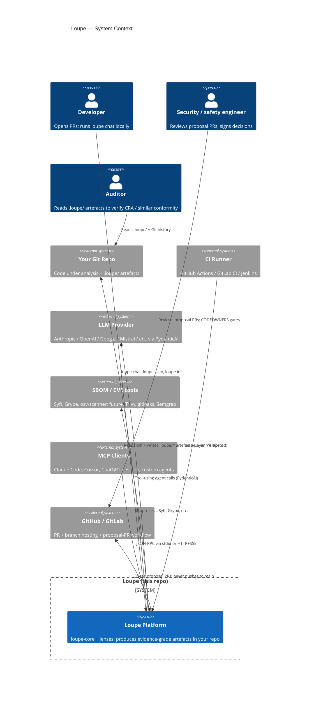
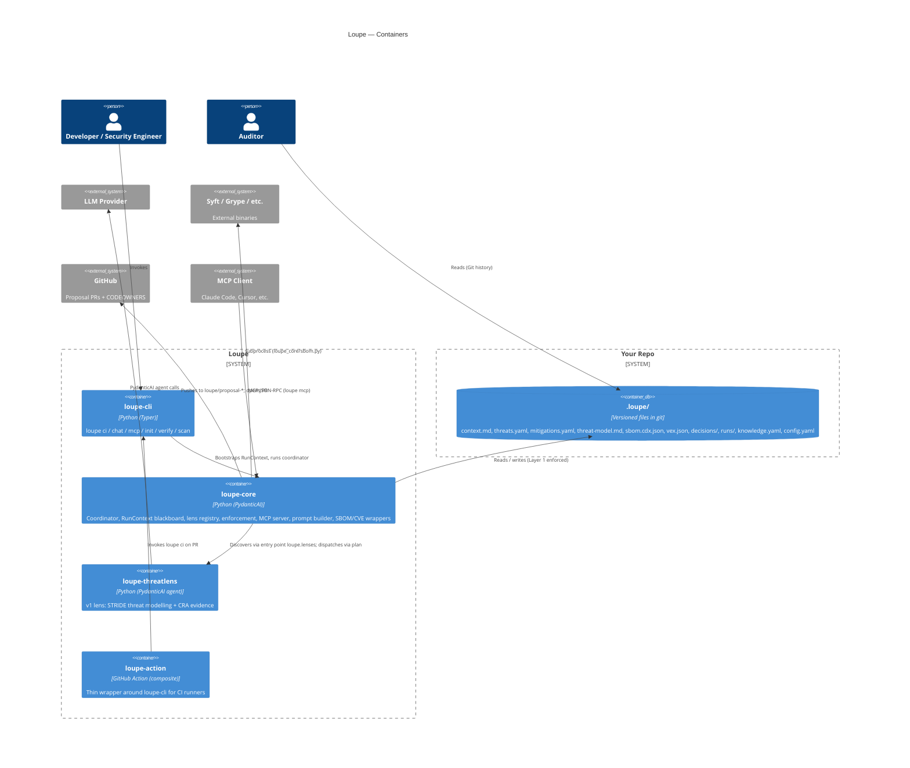
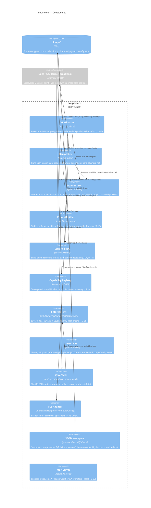
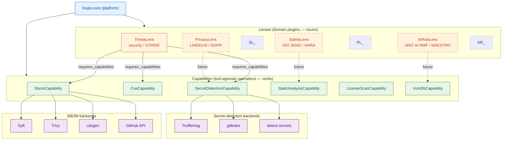
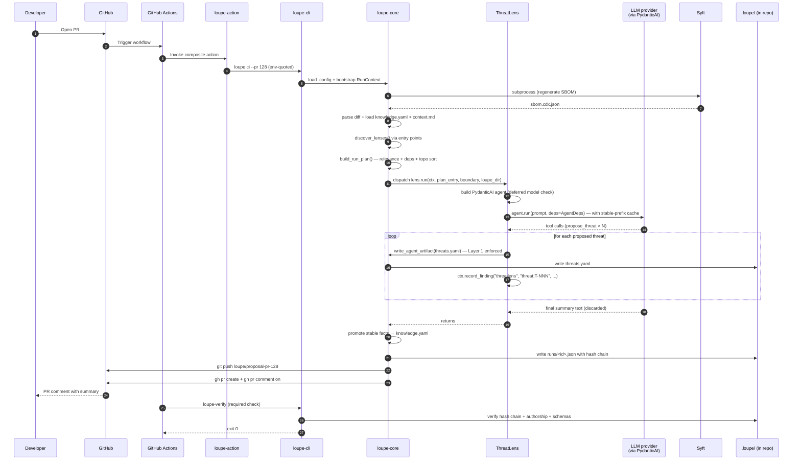
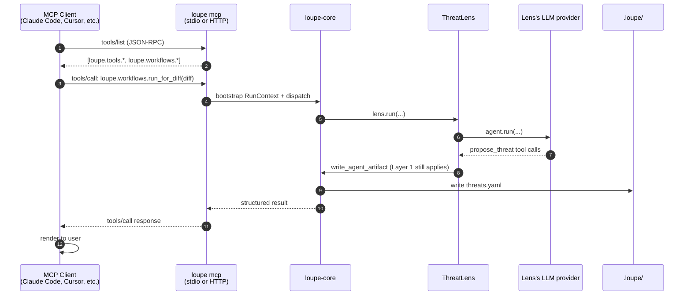

# Architecture (visual)

> All diagrams on this page render natively on GitHub — `mermaid` fenced code blocks, including Mermaid's C4 diagram types. No external services or images.
>
> The diagrams are deliberately layered (C4-style): start at **Context** for the big picture, drill into **Container** for the package shape, then **Component** for `loupe-core` internals. The two **sequence** diagrams at the end show dynamic behaviour (CI run, interactive run).
>
> If something looks wrong in a diagram, the design spec at [`specs/2026-05-13-loupe-design.md`](specs/2026-05-13-loupe-design.md) is the source of truth.

---

## C4 Level 1 — System Context

The big picture: who interacts with Loupe and what external systems it depends on.



---

## C4 Level 2 — Containers

The four Python packages, the in-repo artefact directory, and the external systems they integrate with.



**Notes:**

- The `Container` boxes correspond exactly to the four `packages/*/pyproject.toml` directories in this repo.
- `.loupe/` is a directory, not a separate service — drawn as a container because conceptually it's the system's persistent state.
- Future lenses (SafetyLens, PrivacyLens, AIRiskLens) would sit alongside `loupe-threatlens` here; the diagram would gain one box per future lens.

---

## C4 Level 3 — Components inside `loupe-core`

The internals of the platform. This is where the design decisions (D-01 through D-18) actually take shape in code.



---

## Lens / Capability extension model

A specialised view focusing on Loupe's two parallel extension points (lenses for *domains*, capabilities for *operations*) — see [`CAPABILITIES.md`](CAPABILITIES.md) and [D-18](DESIGN-DECISIONS.md#d-18--capability-abstraction-tool-agnostic-functional-building-blocks).



Solid arrows = current v1; dashed arrows + dashed boxes = future v1.x.

---

## Sequence diagram — CI run on a PR

A walkthrough of what happens when a developer opens a PR and the GitHub Action runs `loupe ci`. This is the "happy path" — the one Loupe is optimised for. See [§7 of the spec](specs/2026-05-13-loupe-design.md#section-7--end-to-end-flows-ci--interactive) for the full prose narrative.



Key properties visible in this diagram:

- **Steps 1–9** happen *before any LLM call* — the deterministic part. Cheap.
- **Step 11** is the only LLM call per lens per run. The stable-prefix cache means the *prompt prefix* is paid full price once and ~10% on subsequent lenses in the same run (D-10).
- **Step 15** is where Layer 1 enforcement actually intercepts — between the lens's intent ("write threats.yaml") and the filesystem.
- **Steps 19–20** complete the audit trail: knowledge graph promotion + hash-chained run record.
- **Steps 21–23** are Layer 2 enforcement: the runner can only push to `loupe/proposal-*` branches and must open a PR — `main` is never touched.

---

## Sequence diagram — Interactive run (`loupe chat`)

The interactive flow differs in two ways: a TTY is required, and every protected-path proposal is gated by a `[y/N/edit/skip]` prompt with default-N (Layer 4 enforcement).

```mermaid
sequenceDiagram
    autonumber
    participant User
    participant Chat as loupe chat
    participant Core as loupe-core
    participant Lens as ThreatLens
    participant LLM as LLM provider
    participant Repo as .loupe/

    User->>Chat: loupe chat
    Chat->>Chat: TTY check (refuses otherwise)
    Chat->>Core: load_config + bootstrap RunContext (mode=interactive)
    Chat->>User: prompt for question
    User->>Chat: "What threats does the new refund endpoint introduce?"
    Chat->>Core: dispatch via coordinator
    Core->>Lens: lens.run(ctx, plan_entry, boundary, loupe_dir)
    Lens->>LLM: agent.run(...) with deps
    LLM-->>Lens: tool call: propose_threat(...)
    Lens->>Chat: render diff for user approval
    Chat->>User: "Apply this patch? [y/N/edit/skip]" (default N)
    User->>Chat: y (or edit + re-confirm, or skip)
    Chat->>Core: write_agent_artifact (Layer 1)
    Core->>Repo: write threats.yaml
    Lens-->>Chat: returns
    Core->>Repo: runs/<id>.json with hash chain
    Chat->>User: cost summary; next prompt
```

Notable differences from CI:

- No proposal PR — changes apply directly to the working tree (the human is the reviewer in real time).
- Every change passes through a default-N prompt — no `--auto-confirm` flag exists.
- The run record still gets written, so the audit trail is intact even for interactive use.

---

## Sequence diagram — Driving Loupe from an external MCP client

When Claude Code, Cursor, or a custom agent attaches to a running `loupe mcp` server and invokes a workflow.



Key invariant: **Layer 1 enforcement applies identically over MCP.** An external client cannot exceed the local agent's authority — the same `PathBoundary` checks every write, regardless of who initiated it.

---

## How to keep these diagrams in sync with the code

A few discipline rules:

1. **When a new package lands in `packages/`**, add a Container box to the Level 2 diagram.
2. **When a new component lands in `loupe-core/`**, add a Component box to the Level 3 diagram and update the `Rel(...)` lines.
3. **When a new lens lands**, add it to the "Lens / Capability extension model" diagram with the appropriate `requires_capabilities` arrows.
4. **When a new capability protocol is defined**, add the box + at least one backend; promote any "future / dashed" status to "current / solid" once shipped.
5. **The sequence diagrams** should be updated when a step in [`§7 of the spec`](specs/2026-05-13-loupe-design.md#section-7--end-to-end-flows-ci--interactive) changes — they're meant to be the visual companion to that narrative.

A future PR-review-toolkit hook could even diff this file's Mermaid against the live entry-point graph and warn on drift, but that's out of scope for v1.

---

## Why C4 + Mermaid (and not PlantUML, Structurizr, or images)

- **GitHub-native rendering** — readers don't need to install anything; the diagrams are visible directly in the rendered Markdown.
- **Source-controlled, diffable, AI-editable** — text in git is auditable in the same way the rest of Loupe is. A regulator can see in `git log` exactly when an arrow was added or removed.
- **C4's deliberate layering** maps cleanly to Loupe's: System Context → Containers → Components is exactly the storey-by-storey walk a new contributor wants.
- **The cost is render quality** — dedicated tools like Structurizr produce nicer-looking diagrams. We pay that cost in exchange for the diagrams living next to the code and updating with PRs.
