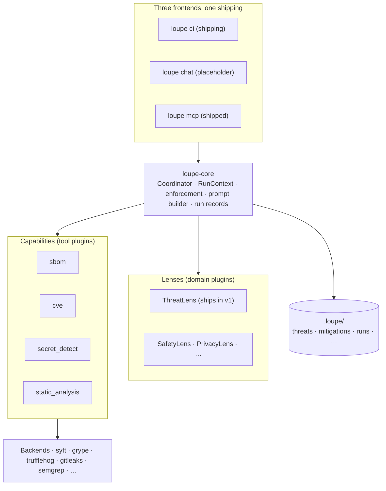
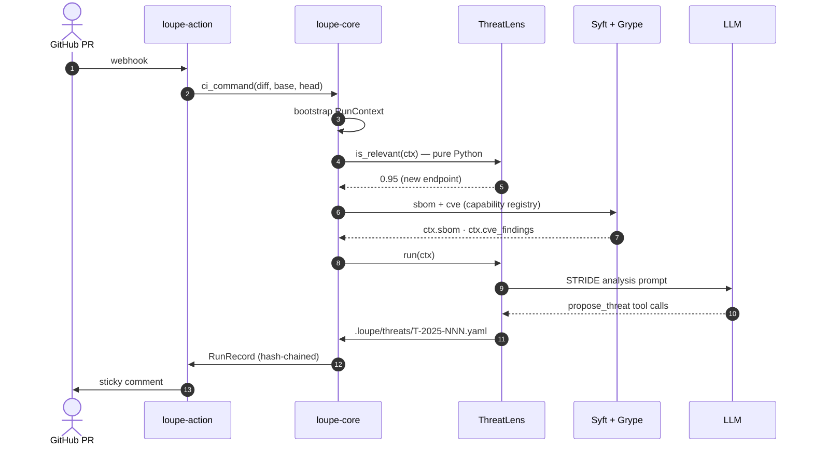

---
tags:
  - concept
  - architecture
---

# Architecture

Two diagrams. The first shows what Loupe is made of and where the plugin slots are. The second shows what happens when a PR rolls in.

## What's in the box

The three frontends are thin shells. The core does the work and owns the enforcement boundary, so each frontend gets the same guarantees. Lenses are *what to look for* (security, safety, privacy). Capabilities are *what tools to call* (SBOM, CVE, secret scanning). Both register through Python entry points; adding either is a pip install plus a config line.

## What a CI run does

`is_relevant()` is pure Python and decides whether the lens runs at all. The SBOM and CVE scans run once per invocation regardless of how many lenses ask for the results. Writes to `.loupe/` go through `write_agent_artifact()`, which enforces the path allow-list from `config.yaml`. Anything outside the allow-list goes to `.loupe/.proposed/` for human review.

The interactive (`loupe chat`) and MCP (`loupe mcp`) flows are the same sequence with different shells. `loupe mcp` is shipped (stdio transport, read tools plus `propose_threat` / `propose_mitigation` write tools) and exposes operations as JSON-RPC tools and workflows. `loupe chat` is still a placeholder: the TTY guard is wired but the conversational `[y/N/edit/skip]` pipeline is not.

## Keeping the diagrams honest

Each diagram should match the code, not the other way around. If you change the bootstrap order, the lens registry, or the sequence of writes during a CI run, update the diagram in the same PR. If a diagram drifts and you notice, treat it as a bug.
