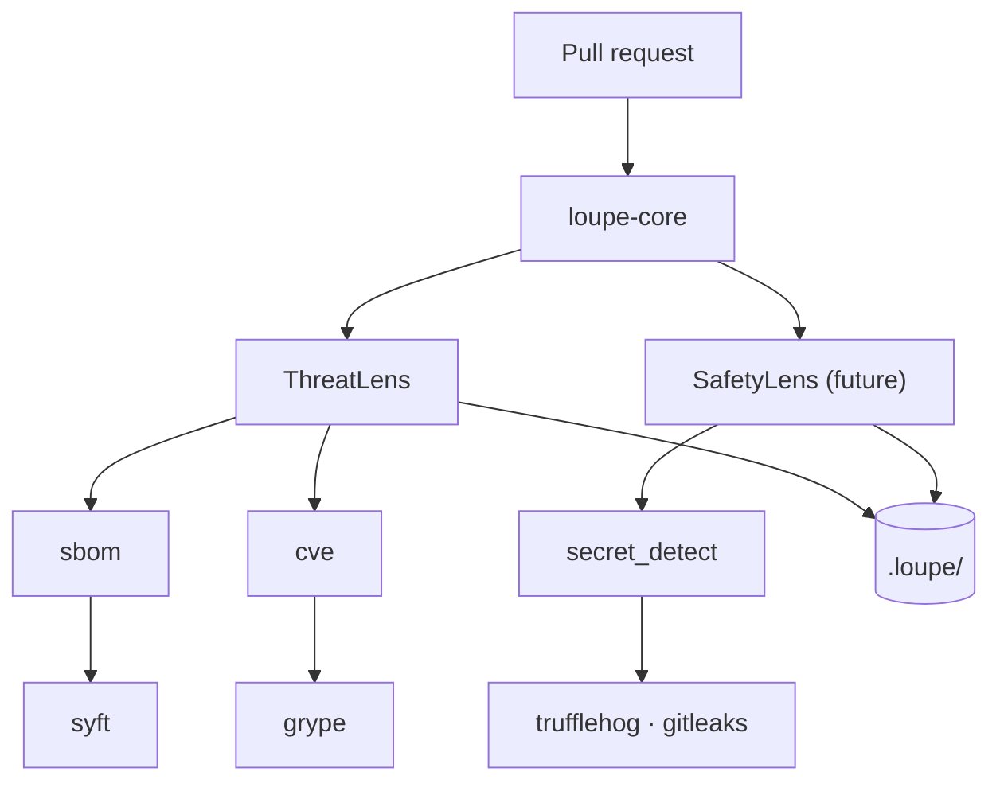

---
hide:
  - toc
---

# Loupe

Auditor-credible AI lenses for code review.

Loupe organised for someone who already knows what an "AI agent for security" is and wants the mental model. If you'd rather jump in, the four cards below are the most common entry points.

-   :material-rocket-launch:{ .lg .middle } &nbsp; **Get started**

    ---

    Install Loupe, scaffold `.loupe/`, run your first analysis on a PR diff.

    [:octicons-arrow-right-24: Quickstart](quickstart.md)

-   :material-eye-outline:{ .lg .middle } &nbsp; **Mental model**

    ---

    The clinic metaphor and how lenses, capabilities, and backends fit.

    [:octicons-arrow-right-24: Architecture](concepts/architecture.md)

-   :material-shield-check:{ .lg .middle } &nbsp; **Verify the claims**

    ---

    For each principle Loupe commits to, the mechanical recipe an auditor runs to confirm it.

    [:octicons-arrow-right-24: Verification](reference/verification.md)

-   :material-compare-horizontal:{ .lg .middle } &nbsp; **Compare**

    ---

    Where Loupe sits next to StrideGPT, IriusRisk, Snyk, Threat Dragon, and more.

    [:octicons-arrow-right-24: Comparison](comparison.md)

## The clinic analogy

The shortest correct answer to "what is Loupe?" is a medical-clinic metaphor that holds all the way down. Use it as scaffolding; everywhere else in the docs you will see one of the four roles, and you will know which layer of the system is doing the work.

A pull request rolls in (the patient). The clinic decides which specialists should see this patient, the specialists order the tests they need, the clinic writes up a chart an external auditor can read.

| Role | What it is | What it does | In Loupe |
|---|---|---|---|
| The clinic | The platform | Orchestrates, files paperwork, enforces boundaries | `loupe-core` |
| The specialist | A lens | Brings domain expertise, decides what to look for | ThreatLens (security), SafetyLens (future), PrivacyLens (future) |
| The diagnostic test | A capability | A tool category specialists can order | `sbom`, `cve`, `secret_detect`, `static_analysis` |
| The test machine | A backend | The specific tool that performs the test | `syft`, `trivy`, `grype`, `trufflehog`, `gitleaks`, `semgrep` |
| The chart | An artefact | The patient's medical record | Files in `.loupe/` |

## How the layers fit

Each layer is replaceable without disturbing the others. Swap `syft` for `trivy` and lenses do not notice. Add `AutoCyberLens` for TARA and the platform does not change. Change the GitHub Action wrapper for a GitLab one and the core stays the same.

For the depth tour of each layer, jump to [Architecture](concepts/architecture.md) (what the core does, how the diagrams stay honest) and [Capabilities](concepts/capabilities.md) (tool-agnostic operations, composition modes, backend registration).

## A walked-through example

Open a PR that adds a new HTTP endpoint and bumps a dependency from `lodash 4.17.20` to `4.17.21`. What happens, step by step:

1. The GitHub Action receives the webhook and calls `loupe ci`.
2. `RunContext.bootstrap()` parses the diff, loads `context.md`, loads `knowledge.yaml`.
3. The coordinator asks ThreatLens `is_relevant(ctx)`. New endpoint plus dependency bump scores 0.95. The lens runs.
4. The capability bootstrap pass runs `syft` (writes to `ctx.sbom`) then `grype` reading `ctx.sbom` (writes to `ctx.cve_findings`).
5. ThreatLens calls its PydanticAI agent with a STRIDE-shaped prompt, the diff, the SBOM, and the CVE list. The agent calls `propose_threat` for each issue. Threats land in `.loupe/threats.yaml`.
6. The run record (hash-chained against the previous run) goes to `.loupe/runs/2026-05-15T*.json`.
7. The Action posts a sticky comment on the PR with severity-grouped findings and the run hash for audit cross-reference.

If you later install SafetyLens, step 4 does not change. Syft already ran. SafetyLens reads `ctx.sbom` off the blackboard.

## What you cannot do

The agent has two write tools: `write_agent_artifact` (path must be in the allow-list) and `propose_patch` (writes to `.loupe/.proposed/` for human review). There is no general "write any file" tool. There is no Bash tool. Protected files (`context.md`, `decisions/*.md`, `config.yaml`) are not in the allow-list; the agent can propose patches but cannot commit them.

In the CI flow today, the agent is restricted to its allow-list paths. When `loupe chat` lands it will prompt `[y/N/edit/skip]` with default-N before each protected-path proposal: no `--auto-confirm` flag, no environment variable that lowers the bar, no way to script-wrap the prompt away.

## Where to go next

-   :material-rocket-launch:{ .lg .middle } **Get something running**

    ---

    Install, scaffold `.loupe/`, run the first `loupe ci` against a real diff.

    [→ Quickstart](quickstart.md)

-   :material-compass-outline:{ .lg .middle } **Understand the principles**

    ---

    The eleven things Loupe will not compromise on, with a one-line summary table.

    [→ Principles](principles.md)

-   :material-book-open-page-variant:{ .lg .middle } **Know why each decision was made**

    ---

    D-01 through D-19. What was considered, what was chosen, why.

    [→ Decisions](reference/decisions.md)

-   :material-scale-balance:{ .lg .middle } **Compare with adjacent tools**

    ---

    Loupe vs StrideGPT, IriusRisk, Threat Dragon, Snyk, Trivy, others.

    [→ Comparison](comparison.md)

-   :material-shield-lock-outline:{ .lg .middle } **Check what data leaves your repo**

    ---

    Network surface, API-key handling, run-record contents, retention.

    [→ Data handling](reference/data-handling.md)

-   :material-source-pull:{ .lg .middle } **Contribute code or a new lens**

    ---

    Workspace layout, test discipline, commit conventions.

    [→ Contributing](contributing.md)

-   :material-console:{ .lg .middle } **Look up a command or flag**

    ---

    Every CLI command, every flag, every exit code.

    [→ CLI reference](reference/cli.md)

-   :material-cog-outline:{ .lg .middle } **Configure capabilities and gates**

    ---

    `config.yaml` end-to-end, with three example presets (minimal, production, audit-heavy).

    [→ Config reference](reference/config.md)

