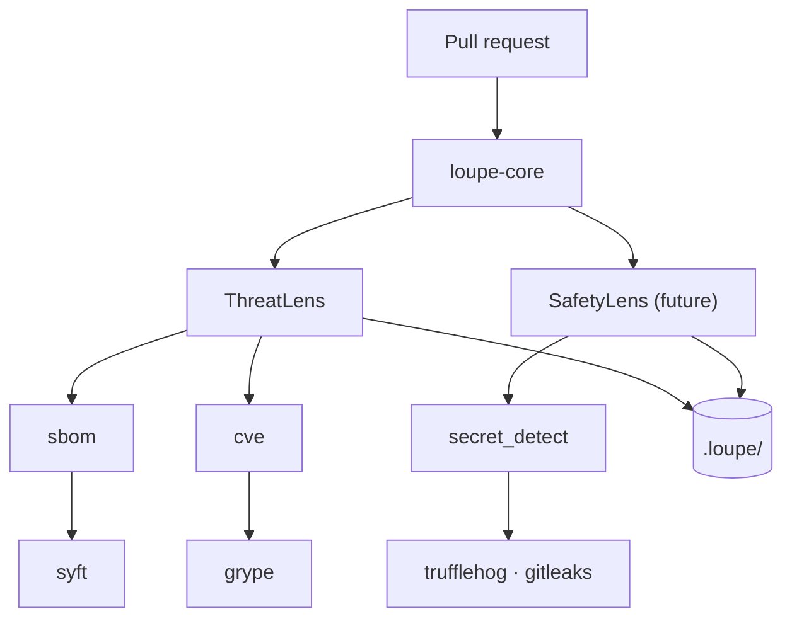

# Loupe in one page

A guided tour of how Loupe is organised for someone who has heard "AI agent for security" before and wants the actual mental model.

## The clinic analogy

The shortest correct answer to "what is Loupe?" is a medical-clinic metaphor that holds all the way down. Use it as scaffolding; everywhere else in the docs you will see one of the four roles, and you will know which layer of the system is doing the work.

A pull request rolls in (the patient). The clinic decides which specialists should see this patient, the specialists order the tests they need, the clinic writes up a chart an external auditor can read.

| Role | What it is | What it does | In Loupe |
|---|---|---|---|
| The clinic | The platform | Orchestrates, files paperwork, enforces boundaries | `loupe-core` |
| The specialist | A lens | Brings domain expertise, decides what to look for | ThreatLens (security), SafetyLens (future), PrivacyLens (future) |
| The diagnostic test | A capability | A tool category specialists can order | `sbom`, `cve`, `secret_detect`, `static_analysis` |
| The test machine | A backend | The specific tool that performs the test | `syft`, `trivy`, `grype`, `trufflehog`, `gitleaks`, `semgrep` |
| The chart | An artefact | The patient's medical record | Files in `.loupe/` |

## How the layers fit



Each layer is replaceable without disturbing the others. Swap `syft` for `trivy` and lenses do not notice. Add `AutoCyberLens` for TARA and the platform does not change. Change the GitHub Action wrapper for a GitLab one and the core stays the same.

## Loupe, the clinic

The platform receives the patient, builds the chart, pages the specialists, orders the shared tests, enforces the write boundary, and files the audit record. It is domain-agnostic: nothing in `loupe-core` knows about STRIDE, ISO 26262, GDPR, or NIST AI RMF.

What it actually does:

| Job | Where it lives |
|---|---|
| Parse the diff | `loupe_core/diff.py` |
| Build the chart (`RunContext`) | `loupe_core/run_context.py` |
| Discover lenses | `loupe_core/lens_registry.py` (Python entry points) |
| Triage (call `is_relevant()` on each lens) | `loupe_core/coordinator.py` |
| Run shared tests once | `loupe_core/capabilities/bootstrap.py` |
| Enforce write boundaries | `loupe_core/enforcement/path_boundary.py` |
| Cache-friendly prompt assembly | `loupe_core/prompt_builder.py` |
| Hash-chained run records | `loupe_core/artifacts/run_record.py` |

Lenses, capabilities, and backends do not import each other. The clinic threads them together.

## Lenses, the specialists

A lens is a Python package that registers via the `loupe.lenses` entry-point group. It contributes:

- A PydanticAI agent specialised for one domain
- Pydantic-typed artefacts the lens owns (paths declared in `artifact_paths`)
- MCP tools and workflows other agents can call
- A pure-Python `is_relevant(ctx) -> RelevanceScore` heuristic for cheap triage
- A list of capabilities it needs (`requires_capabilities=["sbom", "cve"]`)

That is the entire contract. v1 ships ThreatLens. SafetyLens, PrivacyLens, and AIRiskLens are anticipated; each lands as its own pip package without forking the platform.

A specialist doctor does not see every patient. The coordinator asks each enabled lens `is_relevant(ctx)` (cheap, no LLM call) and skips lenses below threshold. A docs-only PR runs zero LLM calls. A single-dependency change runs one lens.

## Capabilities, the diagnostic tests

A specialist does not operate the MRI machine. They order an MRI. The lab runs it. Any specialist who needs the result reads the same scan.

In Loupe, capabilities are tool categories (the verb). Backends are the brands. A lens declares "I need an SBOM"; the capability registry resolves to the backend the operator configured.

```yaml
# .loupe/config.yaml
capabilities:
  sbom:
    mode: single
    backends: [syft]
  cve:
    mode: fallback
    backends: [grype, osv-scanner]
  secret_detect:
    mode: union
    backends: [trufflehog, gitleaks]
  static_analysis:
    mode: consensus
    consensus_threshold: 2
    backends: [semgrep, codeql, bandit]
```

An auditor reads this and knows the team's posture: single SBOM, CVE fallback for resilience, belt-and-braces secret detection, consensus-based SAST for false-positive control. The configuration is the evidence.

When a lens declares `requires_capabilities=["sbom"]`, the platform runs `syft` once and stores the typed `SbomResult` on `ctx.sbom`. Every lens that asks for SBOM reads the same cached value. No re-cost regardless of how many lenses share an input.

The five composition modes:

| Mode | What it does | When to use |
|---|---|---|
| `single` | First backend wins | One tool is enough |
| `fallback` | Try in order until one succeeds | Resilience against the first tool failing |
| `union` | Run all, merge findings | Belt and braces (different tools catch different things) |
| `consensus` | Keep findings ≥N backends agree on | False-positive control |
| `pipeline` | Output of N feeds N+1 | SBOM → CVE is the canonical case |

## Backends, the machines

A backend is the actual subprocess call. Anchore's Syft. Anchore's Grype. TruffleHog. Semgrep. Each backend implements a typed Protocol (`SbomCapability`, `CveCapability`, etc.) and registers via the `loupe.capabilities` entry-point group. Bundled defaults ship inside `loupe-core`; third-party backends arrive as their own pip packages.

```toml
# packages/loupe-core/pyproject.toml
[project.entry-points."loupe.capabilities"]
syft  = "loupe_core.capabilities.backends.syft_sbom:SyftSbomBackend"
grype = "loupe_core.capabilities.backends.grype_cve:GrypeCveBackend"
```

`loupe-core` never imports a backend by name. The registry holds the (capability, backend) index and the operator's `config.yaml` decides what runs.

## A walked-through example

Open a PR that adds a new HTTP endpoint and bumps a dependency from `lodash 4.17.20` to `4.17.21`. What happens, step by step:

1. The GitHub Action receives the webhook and calls `loupe ci`.
2. `RunContext.bootstrap()` parses the diff, loads `context.md`, loads `knowledge.yaml`.
3. The coordinator asks ThreatLens `is_relevant(ctx)`. New endpoint plus dependency bump scores 0.95. The lens runs.
4. The capability bootstrap pass runs `syft` (writes to `ctx.sbom`) then `grype` reading `ctx.sbom` (writes to `ctx.cve_findings`).
5. ThreatLens calls its PydanticAI agent with a STRIDE-shaped prompt, the diff, the SBOM, and the CVE list. The agent calls `propose_threat` for each issue. Threats land in `.loupe/threats.yaml`.
6. The run record (hash-chained against the previous run) goes to `.loupe/runs/2026-05-15T*.json`.
7. The Action posts a sticky comment on the PR with severity-grouped findings and the run hash for audit cross-reference.

If you later install SafetyLens, step 4 does not change. Syft already ran. SafetyLens reads `ctx.sbom` off the blackboard.

## What you cannot do

The agent has two write tools: `write_agent_artifact` (path must be in the allow-list) and `propose_patch` (writes to `.loupe/.proposed/` for human review). There is no general "write any file" tool. There is no Bash tool. Protected files (`context.md`, `decisions/*.md`, `config.yaml`) are not in the allow-list; the agent can propose patches but cannot commit them.

The platform refuses to run unattended when modifying protected paths. `loupe chat` prompts `[y/N/edit/skip]` with default-N. There is no `--auto-confirm` flag and no environment variable that lowers the bar.

## Where to go next

| You want to | Read |
|---|---|
| Get something running | [`start.md`](start.md) |
| Understand the principles | [`PRINCIPLES.md`](PRINCIPLES.md) |
| Know why each decision was made | [`DECISIONS.md`](DECISIONS.md) |
| Compare with adjacent tools | [`COMPARISON.md`](COMPARISON.md) |
| Check what data leaves your repo | [`DATA-HANDLING.md`](DATA-HANDLING.md) |
| Contribute code or a new lens | [`CONTRIBUTING.md`](CONTRIBUTING.md) |
